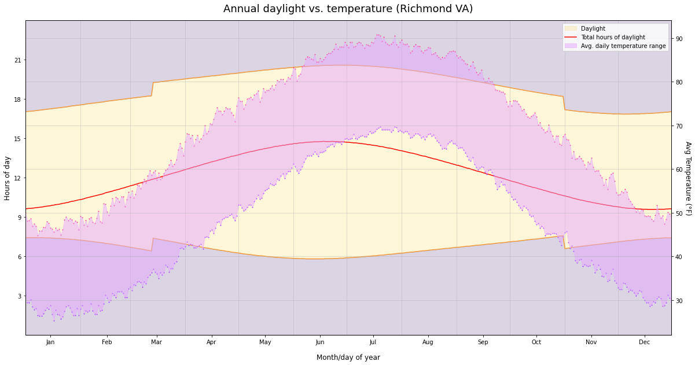

# Richmond VA weather history - demo

## First and last frost dates

I started this project trying to replicate a graph I saw on Twitter last year, which showed how the expected first and late frost dates had both shifted by about 2 weeks over the last 80 years - making winter shorter.

The climate data comes from [NOAA's NCEI/NCDC GHCN-Daily](https://www.ncei.noaa.gov/metadata/geoportal/rest/metadata/item/gov.noaa.ncdc:C00861/html)

I found [Get_NOAA_GHCN data](https://github.com/aaronpenne/get_noaa_ghcn_data) to be very helpful in converting the Daily format to tabular data.

## Seasonal lag

I've always thought it was interesting that people have different ideas about which months are "winter" - if you're measuring the darkest months, it's Nov-Jan, with the winter solstice as "midwinter"; if you're measuring the coldest months, it's Dec-Feb. The lag between insolation (amount of sunlight) and temperature is called the [seasonal lag](https://en.wikipedia.org/wiki/Seasonal_lag), and I wanted to graph it out with local weather and sunrise/sunset data.

The temperature range boundaries are the min/max averages for that day of the year from 1939-2020. 